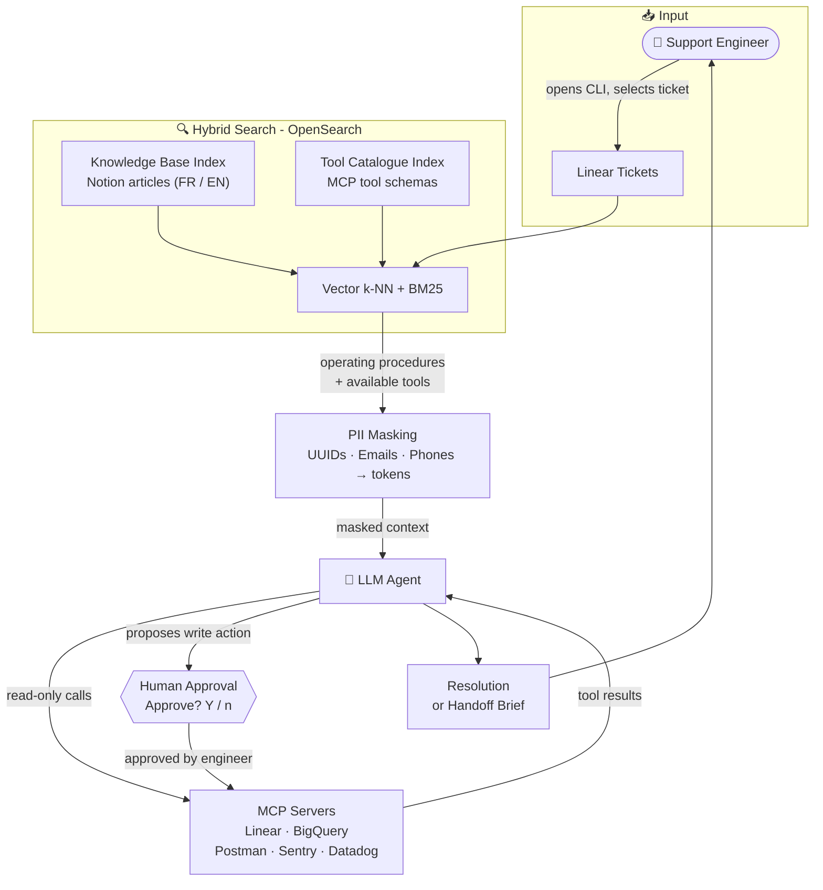
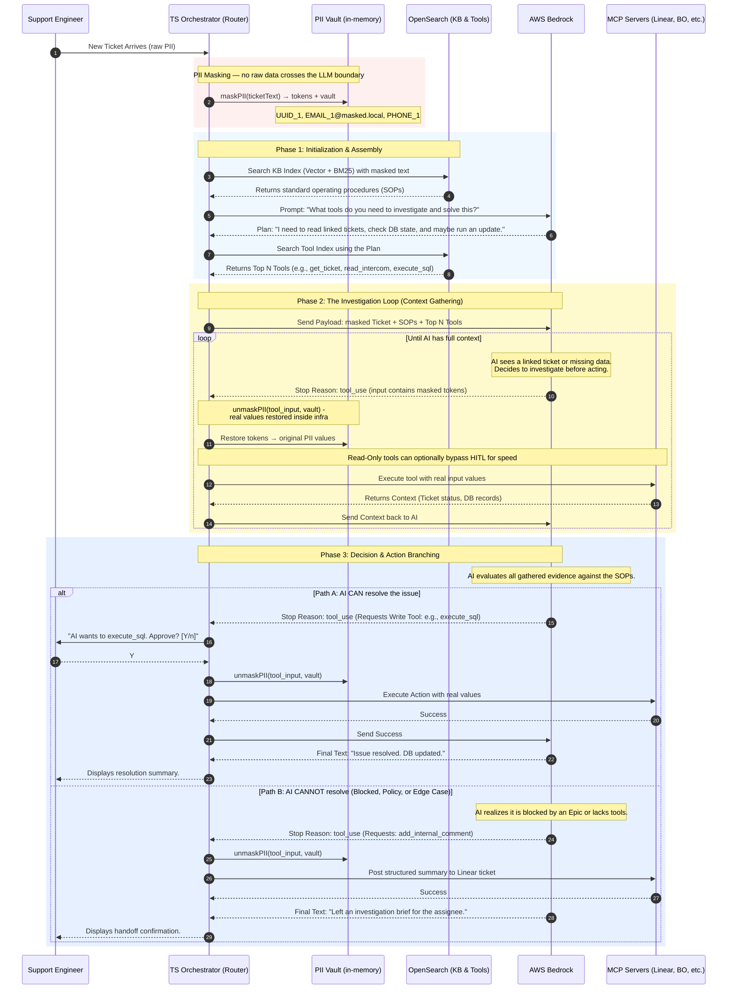

# AI Support Agent

An autonomous, Human-in-the-Loop (HITL) CLI tool designed to assist support engineers. It automatically analyzes support tickets from Linear, retrieves relevant operational instructions from a multilingual Notion Knowledge Base, and executes diagnostic or resolution commands securely via Model Context Protocol (MCP) servers.

## 🌟 Features

- **Multilingual RAG:** Uses `distiluse-base-multilingual-cased-v1` embeddings to seamlessly match English ticket descriptions with French/English Knowledge Base articles.
- **Hybrid Search:** Leverages OpenSearch for a combination of semantic vector search (k-NN) and traditional keyword matching (BM25).
- **Tool Orchestration:** Powered by AWS Bedrock (Claude 3), the agent can reason about a ticket and decide which internal tools to call.
- **PII Masking:** Replaces UUIDs, emails, and phone numbers with opaque tokens before any text is sent to Bedrock. The vault stays in local memory; tokens are restored inside the router before reaching internal MCP servers.
- **Secure Execution (MCP):** Connects to internal systems (BigQuery, Postman APIs, Sentry, Datadog) exclusively through isolated MCP servers.
- **Human-in-the-Loop (HITL):** The agent proposes actions but pauses for explicit human approval (`[Y/n]`) before executing any tool that interacts with internal databases or APIs.

## 🗺️ High-Level Overview



## 🏗️ Architecture

The project uses a polyglot monorepo structure to utilize the best tools for each specific task:

1. **Execution Layer (TypeScript / Node.js):** The live CLI orchestrator. It handles the AWS Bedrock Converse API loop, MCP tool execution, and OpenSearch querying.
2. **Data Pipeline Layer (Python / `uv`):** The offline indexing and evaluation engine. It handles Notion scraping, text chunking, embedding generation, and pushing data to the local OpenSearch cluster.

### System Flow Diagram

The following sequence diagram illustrates how a support ticket is processed, from retrieval to tool execution:



## 📂 Project Structure

```text
support-cli/
├── docker-compose.yml       # Local OpenSearch 2.11.0 cluster
├── mcp-servers.json         # Shared MCP server config — generated by mcp:init
├── package.json             # TypeScript dependencies
├── tsconfig.json            # TypeScript configuration
├── .env                     # Environment variables
├── scripts/
│   └── mcp-init.ts          # Interactive setup wizard for mcp-servers.json
├── src/                     # 🔵 TYPESCRIPT: Execution Layer
│   ├── index.ts             # CLI entry point
│   ├── config.ts            # Strict Settings singleton
│   ├── services/            # Bedrock, OpenSearch, and MCP integrations
│   └── utils/               # HITL prompt utilities
└── data-pipeline/           # 🟡 PYTHON: Indexing & Eval Layer
    ├── pyproject.toml       # Managed by uv
    ├── indexer/
    │   ├── shared/          # Reusable MCP and OpenSearch helpers
    │   ├── scrape_notion.py         # Scrape KB articles from Notion
    │   ├── scrape_mcp_schemas.py    # Download tool schemas from MCP servers
    │   ├── build_index.py           # Embed and index KB articles → support-cli-kb
    │   └── build_schema_index.py    # Embed and index MCP schemas → support-cli-tools
    └── evals/               # Jupyter notebooks for RAG evaluation
```

## 📖 Documentation

- [Hybrid Search](docs/search.md) — How the BM25 + k-NN + RRF retrieval pipeline works
- [Data Pipeline](data-pipeline/README.md) — Scripts for scraping, embedding and indexing KB articles and MCP schemas

## 🚀 Getting Started

### Prerequisites

- **Node.js** (v18+)
- **Python** (v3.10+)
- **Docker** (to run OpenSearch locally)
- **uv** (Python package manager: `curl -LsSf https://astral.sh/uv/install.sh | sh`)
- AWS credentials configured locally (`aws sso login` or standard profile)

### 1. Infrastructure Setup

Start OpenSearch and the embedding server with a single command:

```bash
docker-compose up -d
```

On first run, Docker builds the embedding service image (~2 min) and downloads the
`distiluse-base-multilingual-cased-v1` model (~260 MB) into a named volume.
Subsequent starts are fast — the model is cached in the `hf-cache` volume.

Verify both services are healthy:

```bash
# OpenSearch
curl -s http://localhost:9200/_cluster/health | python3 -m json.tool
# Expected: "status": "green" or "yellow"

# Embedding server
curl -s http://localhost:8001/docs
# Expected: FastAPI OpenAPI page (HTML)
```

> To stop: `docker-compose down`. To also wipe index data and the model cache: `docker-compose down -v`.

### 2. Data Pipeline (Python)

Populate the OpenSearch indices with embedded KB articles (`support-cli-kb`) and MCP tool schemas (`support-cli-tools`):

```bash
cd data-pipeline
uv sync   # install deps (first run only)
```

See **[data-pipeline/README.md](data-pipeline/README.md)** for the full script reference and workflow.

### 3. MCP Server Configuration

The CLI connects to external systems (Linear, Notion, GitHub, GCP) through MCP servers. Run the interactive setup wizard to generate `mcp-servers.json`:

```bash
yarn mcp:init
```

The wizard walks through each available server, asks whether to enable it, and collects any required credentials (e.g. GitHub Personal Access Token, GCP service-account key path). Credentials are saved to `.env`; the config file is written to `mcp-servers.json`.

> **Linear and Notion** use OAuth — no token is required. A browser window will open automatically on first use.
>
> **GitHub** requires a [Personal Access Token](https://github.com/settings/tokens) with `repo` and `read:org` scopes.
>
> **GCP** requires a service-account JSON key with BigQuery / Cloud Storage permissions.

Re-run `yarn mcp:init` at any time to add, remove, or update servers.

### 4. Execution CLI (TypeScript)

Install dependencies and configure your environment:

```bash
npm install

# Ensure your .env file is populated with AWS and OpenSearch variables

```

## 💻 Usage

Run the CLI tool, passing a Linear ticket description as the argument:

```bash
yarn start
```

## Troubleshooting

Start the MCP Inspector to test connectivity to Linear MCP server:

```bash
npx @modelcontextprotocol/inspector npx -y mcp-remote https://mcp.linear.app/mcp
```

This will open a web interface where you can send test commands to the Linear MCP server and see the responses in real time. Use this to debug any connectivity or command execution issues before running the full CLI agent.
